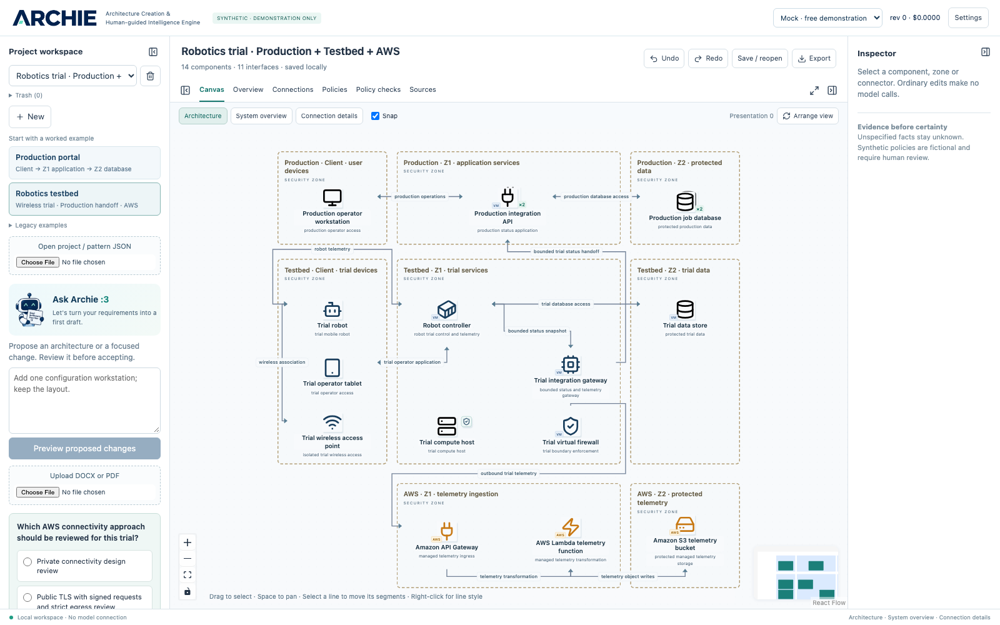

# Archie — Architecture Workbench

A local architecture PoC with a React Flow editor, FastAPI backend, SQLite persistence, source evidence, reviewed assistant changes, fictional policy checks and three views of one model.

**Mac presentation prototype checkpoint, 21 September 2026.** See [PROGRESS.md](PROGRESS.md) for implementation status and remaining work. This is not a claim that all M7 acceptance checks are complete.



## Start

Prerequisites: Python 3.12 and Node.js 20.19+ or 22.12+ and pnpm 11 (Node 22.23.1 / pnpm 11.19.0 tested on Mac). Install dependencies once; normal mock use needs no API key or internet connection.

Windows PowerShell, from the repository root:

```powershell
./scripts/setup.ps1
./scripts/dev.ps1
```

macOS terminal (verified on M2 Max / macOS 26.6.2):

```sh
bash scripts/setup.sh
bash scripts/dev.sh
```

Open <http://127.0.0.1:5173/>. Choose **Production portal** or **Robotics testbed**, inspect the three views, select equipment, and edit properties. VAP references remain under **Legacy examples**. The robot assistant proposes changes for review before acceptance. Ctrl+C stops the development launcher.

Read [synthetic technical specs and follow-up prompts](docs/DEMO_SCENARIOS.md), [global policy library](docs/POLICIES.md), [canvas controls and shortcuts](docs/EDITOR.md), [setup and provider configuration](docs/SETUP.md), [demo walkthrough](docs/DEMO.md), [native Visio handover](docs/VISIO.md), and [checkpoint acceptance matrix](docs/ACCEPTANCE.md).

## Verification

```powershell
.venv/Scripts/python.exe scripts/test.py
.venv/Scripts/python.exe scripts/doctor.py
.venv/Scripts/python.exe scripts/evaluate.py
.venv/Scripts/python.exe scripts/export_samples.py
```

On macOS, run `bash scripts/test.sh` for the offline gate, or use `.venv/bin/python` for the other scripts. The test runner is offline and disables cloud calls. Browser tests use installed Microsoft Edge on Windows; on macOS install Playwright Chromium once as described in setup.

Synthetic input sources and rendered DOCX/PDFs are under `fixtures/projects`. Policies, templates, catalogue, references and development/frozen evaluation fixtures are also under `fixtures`. Rebuild the original packs with `scripts/seed.py`. The four new specifications and two prepared diagrams live under `fixtures/demos`; rebuild them with `scripts/generate_demos.py`. Added symbols are generated by `scripts/generate_assets.py`. These generators never use a model.

## Providers and limits

Distributed defaults are **mock** and **cloud disabled**. `.env` and local databases are excluded from Git. Mock interpretation supports authored fixture statements and a small set of edit prompts. OpenAI uses the Responses API; Ollama uses its native local endpoint. Every live runtime call passes through the budget wrapper; there is no automatic escalation or fallback to cloud.

Real Terra prompt and DOCX journeys passed on the Mac in four requests (about $0.0744). Qwen3:14b passed a small extraction but failed a richer journey; use Terra for the main demo. Historical qwen3:4b/Windows results remain separate. See [Mac provider evidence](reports/mac-resume-20260921-providers.md).

SVG is an image export. The interactive Windows Visio helper creates native shapes/connectors when Visio is installed, but native editability is **unverified** on this host. Synthetic policies are fictional and do not represent organisational approval.

Architecture: `apps/web` → `apps/api/app` → canonical Pydantic model, bounded orchestrator, SQLite/local files. No hosted database, autonomous agent framework, or paid export SDK. Catalogue artwork is licensed in `fixtures/assets/LICENCE.txt`; branding provenance is in `apps/web/public/brand/README.md`.
